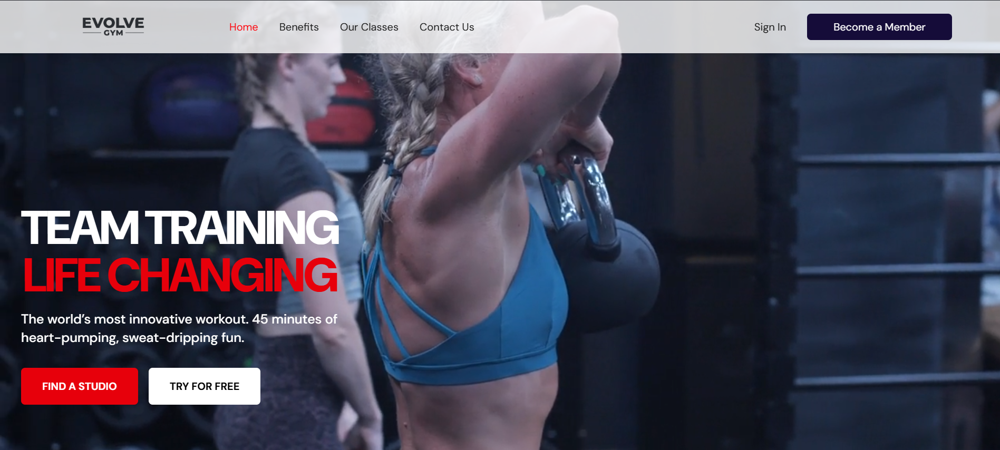
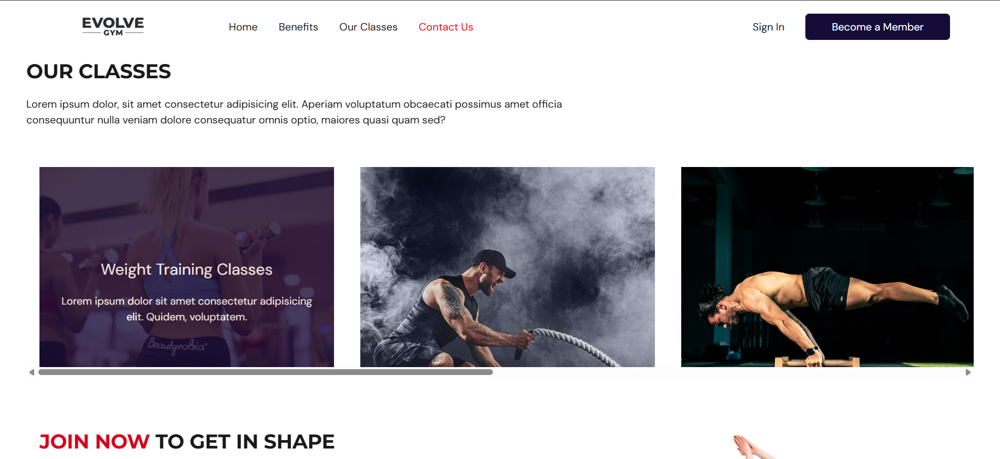

# Evolve Gym - Modern Fitness Website


A modern, animated fitness website built for Evolve Gym. Features smooth animations, responsive design, and an engaging user experience that motivates visitors to start their fitness journey.

---

## 🎯 Project Overview

**Evolve Gym** is a fictional premium fitness center focused on transformation and evolution. This website showcases modern web development practices including:

- ⚡ Lightning-fast React with TypeScript
- 🎨 Beautiful UI with Tailwind CSS
- 🎬 Smooth animations with Framer Motion
- 📱 Fully responsive design
- ♿ Accessibility-first approach
- 🚀 Optimized performance

---

## ✨ Features

### 🏠 Homepage

- **Hero Section**: Dynamic hero with animated call-to-action
- **Features**: Highlight gym's unique selling points
- **Classes Preview**: Showcase of available workout classes
- **Pricing Tiers**: Clear membership options
- **Trainers**: Meet the coaching team
- **Testimonials**: Real member success stories
- **CTA Section**: Final conversion push

### 📄 Pages

- **Classes**: Full catalog with filtering by type/difficulty
- **Membership**: Detailed pricing with FAQ section
- **About**: Gym story, mission, and team profiles
- **Contact**: Contact form with location map

### 🎬 Animations (Framer Motion)

- Smooth page transitions
- Scroll-triggered reveals
- Stagger effects on card grids
- Hover interactions on buttons and cards
- Parallax effects (optional)
- Micro-interactions throughout

### 📱 Responsive Design

- Mobile-first approach
- Breakpoints: Mobile (< 640px), Tablet (640-1024px), Desktop (1024px+)
- Touch-friendly interactions
- Optimized for all screen sizes

---

## 🛠️ Tech Stack

### Core

- **[React 18](https://react.dev/)** - UI framework
- **[TypeScript](https://www.typescriptlang.org/)** - Type safety
- **[Vite](https://vitejs.dev/)** - Build tool and dev server

### Styling

- **[Tailwind CSS](https://tailwindcss.com/)** - Utility-first CSS framework
- **Custom Design System** - Brand colors, typography, spacing

### Animation

- **[Framer Motion](https://www.framer.com/motion/)** - Production-ready animation library

### Routing (if multi-page)

- **[React Router](https://reactrouter.com/)** - Client-side routing

### Forms (optional)

- **[React Hook Form](https://react-hook-form.com/)** - Form validation

### Icons

- **[Heroicons](https://heroicons.com/)** - Tailwind's icon set

---

## 🚀 Getting Started

### Prerequisites

- Node.js 18+ and npm/yarn installed
- Basic knowledge of React and TypeScript

### Installation

1. **Clone the repository**

   ```bash
   git clone https://github.com/yourusername/evolve-gym.git
   cd evolve-gym
   ```

2. **Install dependencies**

   ```bash
   npm install
   # or
   yarn install
   ```

3. **Start development server**

   ```bash
   npm run dev
   # or
   yarn dev
   ```

4. **Open in browser**
   ```
   http://localhost:5173
   ```

### Build for Production

```bash
npm run build
# or
yarn build
```

The optimized build will be in the `dist/` folder.

---

## 📁 Project Structure

```
evolve-gym/
├── public/
│   └── favicon.ico
├── src/
│   ├── assets/
│   │   ├── assets.ts
│   │   └── image1.png
│   │   └── image2.png
│   ├── hooks/
│   │   └── useMediaQuery.ts
│   ├── screens/
│   │   │── navbar
|   |   |    ├── Navbar.tsx
|   |   |    └── Link.tsx
│   │   │── home/
│   │   │    └── Home.tsx
│   │   ├── benefits/
|   |   |    ├── Benefits.tsx
│   │   │    └── Benefit.tsx
│   │   ├── whyEvolve/
│   │   │    ├──Evolve.tsx
|   |   ├── ourClasses/
|   |   |    ├── OurClasses.tsx
|   |   |    └── Class.tsx
│   │   │
│   │   │
│   ├── shared/
│   │   ├── ActionButton.tsx
│   │   ├── Button.tsx
│   │   ├── RollingRibbon.tsx
│   │   ├── types.ts
│   ├── types/
│   │
│   ├── App.tsx
│   ├── main.tsx
│   └── index.css
├── .gitignore
├── package.json
├── tsconfig.json
├── vite.config.ts
└── README.md
```

---

## 📝 Component Examples

### Button Component (Conceptual)

**Features:**

- Multiple variants (primary, secondary, outline)
- Multiple sizes (sm, md, lg)
- Hover and tap animations
- Loading state
- TypeScript props

### Card Component (Conceptual)

**Features:**

- Hover lift effect
- Shadow transitions
- Image zoom on hover
- TypeScript interface for content

### Form Components (Conceptual)

**Features:**

- Validation with error messages
- Accessible labels
- Loading states
- Success/error feedback

---

## 🧪 Testing Checklist

### Functionality

- [ ] All navigation links work
- [ ] Mobile menu opens/closes
- [ ] Forms validate correctly
- [ ] All images load properly
- [ ] No console errors

### Responsiveness

- [ ] Mobile (375px - 640px)
- [ ] Tablet (640px - 1024px)
- [ ] Desktop (1024px - 1440px)
- [ ] Large desktop (1440px+)

### Performance

- [ ] First Contentful Paint < 1.5s
- [ ] Largest Contentful Paint < 2.5s
- [ ] Total Blocking Time < 200ms
- [ ] Cumulative Layout Shift < 0.1

### Accessibility

- [ ] Keyboard navigation works
- [ ] Focus states visible
- [ ] Images have alt text
- [ ] Color contrast meets WCAG AA
- [ ] Screen reader friendly

### Browser Compatibility

- [ ] Chrome/Edge (latest)
- [ ] Firefox (latest)
- [ ] Safari (latest)
- [ ] Mobile browsers

---

## 📚 Learning Resources

### React & TypeScript

- [React Docs](https://react.dev/)
- [TypeScript Handbook](https://www.typescriptlang.org/docs/)
- [React TypeScript Cheatsheet](https://react-typescript-cheatsheet.netlify.app/)

### Tailwind CSS

- [Tailwind Docs](https://tailwindcss.com/docs)
- [Tailwind UI Components](https://tailwindui.com/)

### Framer Motion

- [Framer Motion Docs](https://www.framer.com/motion/)
- [Framer Motion Examples](https://www.framer.com/motion/examples/)

### Design Inspiration

- [Awwwards](https://www.awwwards.com/)
- [Dribbble](https://dribbble.com/tags/gym-website)
- [Behance](https://www.behance.net/search/projects?search=fitness%20website)

---

## 🐛 Known Issues

- [ ] _None yet - will update as development progresses_

---

## 🤝 Contributing

This is a personal learning project, but suggestions are welcome!

1. Fork the repository
2. Create your feature branch (`git checkout -b feature/AmazingFeature`)
3. Commit your changes (`git commit -m 'Add some AmazingFeature'`)
4. Push to the branch (`git push origin feature/AmazingFeature`)
5. Open a Pull Request

---

## 📄 License

This project is open source and available under the [MIT License](LICENSE).

---

## 👤 Author

**Nehal Adil**

<!-- - Portfolio: [yourportfolio.com](https://yourportfolio.com) -->

- GitHub: [@Mr.Owl](https://github.com/Nehal-Adil)
- LinkedIn: [Nehal Adil](https://linkedin.com/in/nehal-adil)
- Email: mdnehaladil@gmail.com

---

## 🙏 Acknowledgments

- **Design Inspiration**: F45 Training
- **Icons**: Heroicons
- **Images**: Unsplash, Pexels (all placeholder images)
- **Fonts**: Google Fonts (DM Sans, Montserrat)
- **Community**: React, TypeScript, Tailwind CSS communities

---

## 📸 Screenshots

### Desktop View




---

## 🔗 Live Demo

**Live Site**: [Coming Soon]

---

**Built with ❤️ and lots of ☕**

_Transform your body. Elevate your mind. Evolve._
